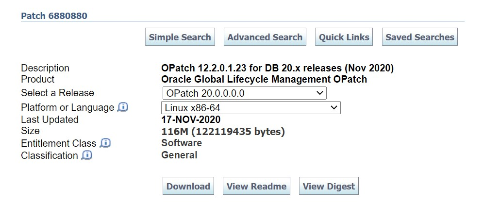

## Description:-

This article we are going to see steps used to apply the latest Oracle 19c Database Release Update 19.20.0.0.0 & OJVM elease Update 19.20.0.0.0

- 35320081 - DATABASE RELEASE UPDATE 19.20.0.0.0
- 35354406 - OJVM RELEASE UPDATE 19.20.0.0.0
- 6880880 - OPatch 12.2.0.1.43 for DB 23.0.0.0.0 (Jul 2024)

### Step 1: Download the above required Patches from Oracle Support.


Step 2: Copied the patch to teh Database Server.



```bash
mkdir -p /u01/Oracle_Patches
```

Using WinSCP on windows, copy the Downloaded Patched to `/u01/Oracle_Patches/` and change its permissions.
```bash
cd /u01/Oracle_Patches/
chmod 775 *
```

### Step 3: Upgrade Opatch Tool from 12.2.0.1.17 to 12.2.0.1.43

Unzip the OPatch .zip file and confirm the version.
```bash
unzip p6880880_200000_Linux-x86-64.zip
cd /u01/Oracle_Patches/Opatch
./opatch version
```
You Should get the following Output
```bash
OPatch Version: 12.2.0.1.17.
OPatch succeeded.
```

Now backup the existing OPatch present in `$ORACLE_HOME` and move the Opatch to `$ORACLE_HOME` directory.

```bash
cd $ORACLE_HOME
mv OPatch OPatch_BKP_DATE
```
```bash
cd /u01/Oracle_Patches/
mv OPatch $ORACLE_HOME
```

### Step 4: Check Patches status before apply using below query

Login to the Database
```sql
SET LINESIZE 500
SET PAGESIZE 1000
SET SERVEROUT ON
SET LONG 2000000
select patch_id,PATCH_TYPE, action, status, action_time from dba_registry_sqlpatch;
```

Identifying Invalid Objects before patching
```sql
COLUMN object_name FORMAT A30
SELECT owner,
object_type,
object_name,
status
FROM dba_objects
WHERE status = 'INVALID'
ORDER BY owner, object_type, object_name;
```

### Step 5: Shutdown Database and Listener

Login to the Database
```sql
shut immediate
```
```bash
LSNRCTL STOP
```


### Step 6: Take Backup of `$ORACLE_HOME` and Databases.

```bash
mkdir -p /u01/ORACLE_HOME_BKP_05OCT2024
cd $ORACLE_HOME
tar -cvf ORACLE_HOME_05OCT2024.tar $ORACLE_HOME
```

Connect to RMAN and take a full backup of the Databases.

### Step7: Apply RU patch on `ORACLE_HOME` 19c.

Unzip the Release Update Patch
```bash
unzip -q p35320081_190000_Linux-x86-64.zip
cd /u01/Oracle_Patches/
```
Check If there is any Patch Conflict with ORACLE_HOME
```bash
/u01/app/oracle/product/19.3/db_home/OPatch/opatch prereq CheckConflictAgainstOHWithDetail -ph /u01/Oracle_Patches/35320081
/u01/app/oracle/product/19.3/db_home/OPatch/opatch prereq CheckConflictAgainstOHWithDetail -ph /u01/Oracle_Patches/35354406
```
If there are no conflicts with ORACLE_HOME then Proceed to Apply the Patch.
```bash
cd /u01/Oracle_Patches/35320081 
/u01/app/oracle/product/19.3/db_home/OPatch/opatch apply
```

```bash
/u01/app/oracle/product/19.3/db_home/OPatch/opatch lsinventory | grep "Patch description"
/u01/app/oracle/product/19.3/db_home/OPatch/opatch lsinv | grep applied
```


```bash
...
Verifying environment and performing prerequisite checks…
OPatch continues with these patches: 35320081
Do you want to proceed? [y|n]
y
User Responded with: Y
All checks passed.
Please shutdown Oracle instances running out of this ORACLE_HOME on the local system.
(Oracle Home = '/usr/local/oracle/19c')
Is the local system ready for patching? [y|n]
y
User Responded with: Y.
Backing up files…
```
