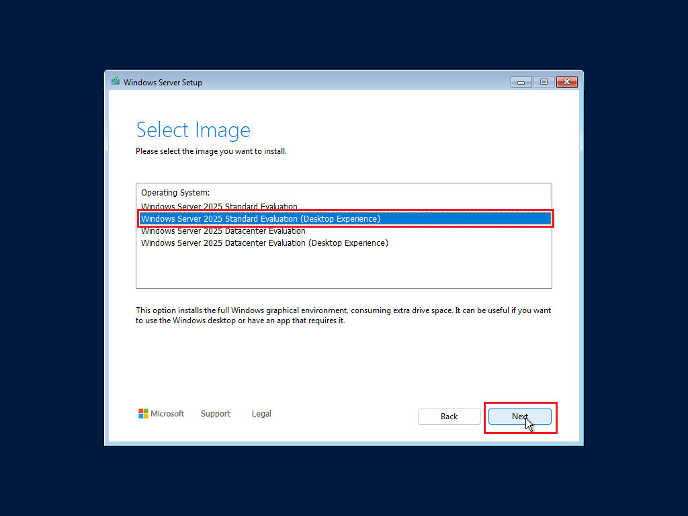

# Step-by-Step Guide to Creating a Windows Server 2025 VM Using VMware Workstation Pro

In this guide, we'll walk through the process of setting up a Windows Server 2025 virtual machine using VMware Workstation Pro. This guide is ideal for users who want to set up a Windows Server environment for testing or development.

## Prerequisites

Before we begin, ensure you have the following:
- **VMware Workstation Pro**: Make sure VMware Workstation Pro is installed and licensed (License is now Free for Personal Use).
- **Windows Server 2025 ISO file**: Download the official ISO file from Microsoft Offical Website.
- **Adequate system resources**: At least 4 GB RAM, 2 CPU cores, and sufficient disk space for the VM.

---

## Step 1: Launch VMware Workstation Pro

1. Open **VMware Workstation Pro** from your desktop or start menu.
2. From the **Home** screen, click on **Create a New Virtual Machine** or go to **File** > **New Virtual Machine** or press `Ctrl+N`

---

## Step 2: Configure Virtual Machine Settings

1. In the **New Virtual Machine Wizard**, select **Custom (advanced)** and click **Next**.

2. Leave Everything at defaults and Click **Next**.

---

## Step 3: Guest Operating System Installation

1. In the **Guest Operating System Installation** window, select **I will install the operating system later.** as the operating system.Click **Next**.

2.In the **Guest Operating System** window, select **Microsoft Windows** as the operating system.
3. From the **Version** dropdown, choose **Windows Server 2022** (if Windows Server 2025 is not listed, select the closest match). Click **Next**.

---

## Step 4: Name the Virtual Machine and Choose Location

1. **Name** your virtual machine (e.g., "Windows Server 2025").
2. Choose a **location** to save your VM files or accept the default path. Click **Next**.

3. In the **Firmware Type**  Window choose **UEFI**. Click **Next**.

---

## Step 5: Set Processor and Memory for the VM RAM, connection type and Controller Type.

1. In the **Processor Configuration** window.
* Select **2** for the number of Processors.
* Select **2** for the number of cores per Processors.

2. In the **Memory for the Virtual Machine** window. Set **4GB** Memory to the VM.

3. In the **Network Type** window select **Use bridged networking**

4. In the **Select I/O Controller Types** select **LSI Logical SAS (Recommmended)**

---

## Step 6: Set Disk Size and Storage Options.
1. In the **Select Disk Type** window, select **NVMe (Recommmended)**.

2. In the **Select a Disk** window, choose **Create a new virtual disk**. Click **Next**

3. In the **Specify Disk Capacity** window, choose a disk size appropriate for your VM. **60 GB** is recommended.
Select **Store virtual disk as a single file** for simplicity (you may also choose **Split virtual disk into multiple files** if needed).

4. In the **Specify Disk File** window, choose a disk file location of your choice.

5. Click **Next**.

## Step 7: Customize Hardware (Optional)

1. To optimize performance, click on **Customize Hardware**.
2. Adjust the **Memory** to at least **4 GB** (or more, depending on your system’s capacity).
3. Set **Processors** to at least **2 cores**.
4. Optionally, configure **Network Adapter** settings, **USB Controller**, or **Display** options as required.
5. Once done, click **Close**, then **Finish**.

---
## Step 8: Add an Additional Hard Disk for Oracle ASM Disks.
1. Return to the main VMware Workstation Pro window.
2. Locate your new VM from the **Library** and select it. **(Windows Server 2022)**
3. Right Click and Select **Settings**.

4. In the **Virual Machine Settings** Window, Click **Add**.

5. In the **Add Hardware Wizard** Window, select **Hard Disk**. Click **Next**, select **NVMe** and Click **Next**

6. In the **Select a Disk** window, choose **Create a new virtual disk**. Click **Next**.

7. In the **Specify Disk Capacity** window, choose a disk size appropriate for your VM. **60 GB** is recommended.

Select **Store virtual disk as a single file** for simplicity (you may also choose **Split virtual disk into multiple files** if needed).
8. In the **Specify Disk File** window, choose a disk file location of your choice.

9. Click **Next**.

## Step 9: Add the Windows Server 2025 ISO File.
1. In the **Virtual Machine Settings** click **CD/DVD (SATA)** and select the **Use ISO Image file**.

2. Browse for the **Windows Server 2025** ISO image.
3. Click **OK** close the **Virtual Machine Settings** 

## Step 9: Power On the Virtual Machine

1. Return to the main VMware Workstation Pro window.
2. Locate your new VM from the **Library** and select it.
3. Click **Power on this virtual machine** to start the installation process.

---

## Step 8: Install Windows Server 2025

1. Upon powering on the VM, you’ll see the **Windows Server Setup** screen.
2. Select your **Language, Time** and **Currency format** preferences, then click **Next**.

3. Click **Next**.
4. Select your **Keyboard or input method** then click **Next**.

5. Select your **Install Windows Server** and select **I agree everyting will be deleted including files, app, and settings**  click **Next**.

6. Choose the **Windows Server edition** you want to install i.e **Windows Server 2025 Standard Evaluation (Desktop Experience)**. Click **Next**.

7. Click **Accept** to accept the license terms.

8. Select the Select the virtual disk that you created earlier **Disk 0** to install Windows Server and click **Next**.

9. Windows Server 2025 Installation will Begin.

---

## Step 09: Complete Initial Setup and Configure Admin Account

1. After installation, Windows Server will reboot. You’ll be prompted to set up an **Administrator password**.
2. Enter a strong password and press **Finish**.

---

## Step 10: Log In to Windows Server 2025

1. Once the setup is complete, press **Ctrl+Alt+Del** (or use VMware's **Send Ctrl+Alt+Del** option).
2. Log in using the **Administrator** account and password you set up.

---

## Step 11: Install VMware Tools (Optional but Recommended)

1. After logging in, go to the **VM** menu in VMware Workstation Pro.
2. Select **Install VMware Tools** to enhance VM performance, such as improved graphics and seamless mouse integration.
3. Follow the on-screen instructions to install VMware Tools and reboot if necessary.

---

Congratulations! You've successfully set up a Windows Server 2025 VM in VMware Workstation Pro. You can now begin configuring your server environment, install roles and features, and use it for testing or development purposes.

---

Happy virtualizing!
